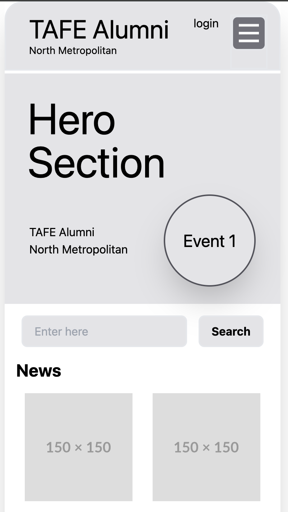
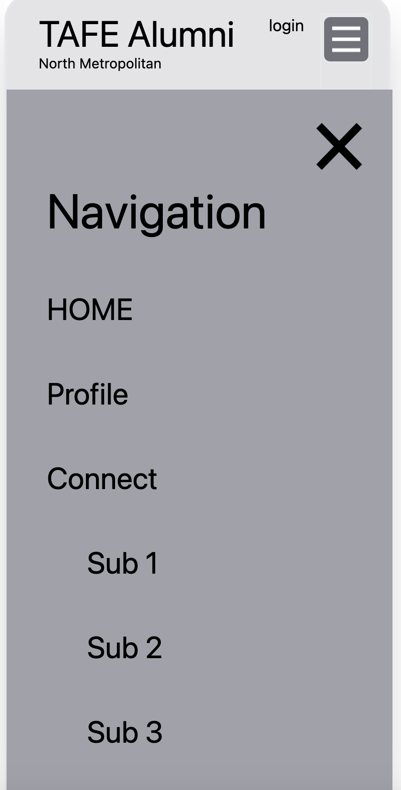

# ICTWEB522 - Develop website information architecture

## Summary

This document provides an overview of the NMTAFE Alumni APP prototype, showcasing features and user interface. The prototype aims to deliver visually appealing experience.

> [!note]  
> Used tools for this prototype webpage
>
> - Visual Studio Code
> - HTML and CSS (TailwindCSS)
> - JavaScript

> [!note]  
> Implemented features:
>
> - HomePage
> - Navigation interaction with hamburger button
> - Profile page

> [!tip]  
> Repo: https://github.com/20111176/ICTWEB522-Information-Architecture  
> Live page: https://20111176.github.io/ICTWEB522-Information-Architecture/

## Homepage

 

## Menu page

 

## Profile Page

